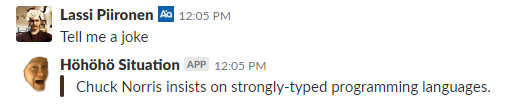

 
# Coffee Situation #

### What is this repository for?

The coffee situation bot observes the current office coffee machines situation as it is important to know the status of the coffee situation

#### Description

On a slack channel, the bot app listens for specific keywords eg. coffee, kahavia.. and on a match it responds with a situation message that has an image link attached to it. The image is taken by the coffee observation device and it is from the office coffee machine.

The user sees couple of things

##### The response:

The slack bot responses to different events

Event	     | Message type	 | Response 
------------ | ------------- | -------------
Coffee keyword | On a channel | 
Joke | Direct message | 
Status | Direct message | 
Connection error | -	| 
Unspecified error | - | 

The responses have some randomness on the icon and the affix text


##### The Image:

The observation device takes an image and reports it as a temporary link


Example situation image with some visual blocking

* Image contents vary depending on the observation device positioning
* should the device positioning resulted images reveal too much of for example some corporate secrets or public spaces the resulting image can be filtered with visual blocks or even face blurring :sparkles: 
* images have a limited lifetime


:sparkles: results may vary

#### Usage

##### Slackbot app direct commands

> - Help: Prints this usage text
> - Status: Checks if the coffee situation monitoring device is online
> - Joke: Well, why not?
> - List: Prints accepted coffee related keywords
> - `Coffee keyword`: Takes a photo of the current coffee situation

##### The observation device configurations #####

**TODO:** Description of the different device mode configurations

#### Coming up in the next episode ####

* In coming versions there should be some real coffee situation senseness
* automaticish area visual blocking
* improvements on the face blurring
* OpenCV related device stability

### How do I get set up? ###

#### Summary of set 

The app consists of a Rasbperry Pi device taking pictures and a Slack app reporting the results. Thus there are two different setups and configurations.  
##### Setup Uno: Slackbot

###### Dependencies

The slackbot app runs and installs with:

* python3
* cron
* pip3
* git

1. Clone the repository

```
git clone https://github.com/lsipii/coffeesituation.git 
```

2. Install the bot requirements

For the slackbot hosting server the reqs are listed in the slackbot_requirements.txt file

```
pip3 install -r coffeesituation/slackbot_requirements.txt
```


###### Deployment instructions

1. Copy the example configurations:

```
cp config/slackbotApp.example.json config/slackbotApp.json
```

2. Configure at the very least

> 1. SLACK_BOT_TOKEN: The slack access key, by which the bot connects to the Slack workplace
> 2. SLACK_BOT_MAINTAINER: Slack user ID, eg. W012A3CDE
> 3. COFFEE_BOT_TOKEN: The access key to the coffee observation device, self generated shared secret
> 4. COFFEE_BOT_URL: The public access url of the coffee bot device, eg. https://xxXXxxXXXXxx.dataplicity.io

3. Cronjob configurations

by

```
crontab -e
```

add lines, for example (fix the paths):

```
@reboot /path/to/coffeesituation/shell/ensureSlackBotAppRunning.sh
16 2 * * * /path/to/coffeesituation/shell/selfUpdate.sh
10,27 * * * * /path/to/coffeesituation/shell/ensureSlackBotAppRunning.sh
```

##### Setup Dos: The Rasperry Pi Observation device

**TODO:** Raspberry Pi setups

###### Dependencies

The dependency installations are better described in the Dockerfile

Thought, multiliner and multistepper without OpenCV support would be

1. Base requirements
```
sudo apt-get update -y && sudo apt-get install -y git python3-pip nginx motion git
```

2. Motion configurations
```
sudo sed -i 's/daemon off/daemon on/g' /etc/motion/motion.conf && \
	sudo sed -i 's/stream_localhost on/stream_localhost off/g' /etc/motion/motion.conf && \
	sudo sed -i 's/stream_port 0/stream_port 8081/g' /etc/motion/motion.conf && \
	sudo sed -i 's/output_pictures on/output_pictures off/g' /etc/motion/motion.conf && \
	sudo sed -i 's/ffmpeg_output_movies on/ffmpeg_output_movies off/g' /etc/motion/motion.conf && \
	sudo sed -i 's/stream_maxrate 1/stream_maxrate 25/g' /etc/motion/motion.conf && \
	sudo sed -i 's/framerate 100/framerate 25/g' /etc/motion/motion.conf && \
	sudo sed -i 's/width 352/width 640/g' /etc/motion/motion.conf && \
	sudo sed -i 's/height 288/height 480/g' /etc/motion/motion.conf && \
	sudo sed -i 's/start_motion_daemon=no/start_motion_daemon=yes/g' /etc/default/motion && \
	sudo systemctl disable motion
```

3. Clone the repository if not yet done

```
git clone https://github.com/lsipii/coffeesituation.git 
```

4. nginx configurations
```
sudo cp ./coffeesituation/docker/nginx/sites/default.conf /etc/nginx/sites-available/default && \
	sudo mkdir -p /var/www/html/images && sudo cp ./coffeesituation/docker/nginx/404/404.jpg /var/www/html/images
```

5. The deviceApp python requirements
```
pip3 install -r ./coffeesituation/requirements.txt
```

###### Deployment instructions

**TODO:** better decribe the setup using dataplicity, 
- but for now it's pretty straightforward: https://www.dataplicity.com/devices/
- enable the wormhole
- get the public address and reference where called for a COFFEE_BOT_URL setting

**TODO:** setup using resin.io
- ...

1. Copy the example device configuration file
```
cp ./coffeesituation/config/deviceApp.example.json ./coffeesituation/config/deviceApp.json
```

2. Fill important parts of the json file

> 1. app.host: the devices public address eg. the COFFEE_BOT_URL
> 2. app.storage_driver: "local" or "S3"
> 3. apiAccess.Coffee Related Communication And Relations Facilitator.api_token: the SlackBot access token, the COFFEE_BOT_TOKEN setting of the SlackBot
> 4. storage.local or storage.S3

3. Test if the app starts running

```
./coffeesituation/deviceApp.py 
```

- Stop by ctrl-c

4. Cronjob configurations

by a crontab editing command:

```
crontab -e
```

add lines:

```
@reboot /home/pi/coffeesituation/shell/ensureDeviceAppRunning.sh
15 2 * * * /home/pi/coffeesituation/shell/selfUpdate.sh
20,57 * * * * /home/pi/coffeesituation/shell/ensureDeviceAppRunning.sh
10,35,44 * * * * /home/pi/coffeesituation/shell/ensureRaspberryPiNetwork.sh
```

If using S3 storage, add also a:

```
2 * * * * /home/pi/coffeesituation/S3BucketGC_cronjob.py
```

5. Finalize by a reboot
```
sudo reboot
```


# References:

Turtle photo: https://www.pexels.com/fi-fi/kuva/elain-elainkuvaus-kilpikonna-lahikuva-2289601/

